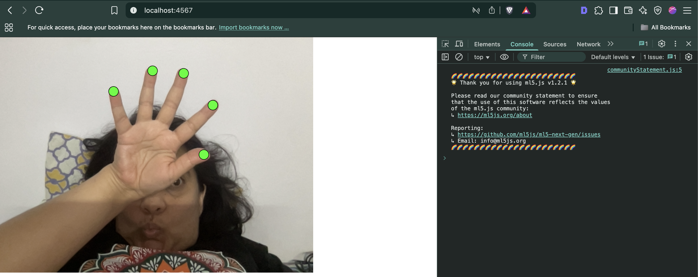

Connecting OSC signal from p5js > sonic Pi

Here the sonic pi values should change based on how close you bring your fingers to your thumb. Each value is assigned to specific finger.

# Step 1

`git clone repo`

# Step 2
```bash
cd sonic-osc-p5
npm i
npm run start
```

# Step 3
Open Sonic Pi

Add the code below:

```
live_loop :osc_rec do
  use_real_time
  a, b, c, d = sync "/osc*/p5js"

  note = (40 + (a / 640.0) * 60).to_i

  ## please fix the mapping
  cutoff = (60 + (b / 480.0) * 60).to_i
  sustain = c
  release = release
  ##| puts "Note: #{note}, Cutoff: #{cutoff}, Sustain: #{sustain}"

  synth :prophet, note: note, cutoff: cutoff, sustain: sustain, release: release
end
```
Hit "run"

# Step 4
Open `localhost:4567`

Move hands! 🙌 ✋

